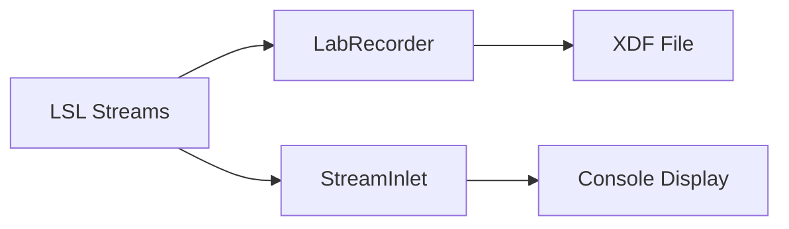

# Convert to lab-recorder-python

## Overview

Replace the removed `bsl.StreamReceiver` with `lab-recorder-python`'s `LabRecorder` class and direct `pylsl.StreamInlet` for real-time data display.

---

## 1. Update `lsl_reciever.py`

The current script uses `bsl.StreamReceiver` which no longer exists. Replace with:

**Architecture:**



**Key changes to [scripts/lsl_reciever.py](emotiv-lsl/scripts/lsl_reciever.py):**

- Remove commented `bsl` imports
- Use `LabRecorder.find_streams()` instead of `resolve_streams()` for discovery
- Create `pylsl.StreamInlet` for real-time console display
- Use `LabRecorder` to record streams to XDF in parallel
- Replace `StreamReceiver.acquire()` pattern with `inlet.pull_chunk()` pattern

**Reference pattern from lab-recorder-python's dummy_receiver.py:**

```python
from pylsl import StreamInlet
from labrecorder import LabRecorder

# For display: use inlet.pull_sample() or inlet.pull_chunk()
# For recording: use LabRecorder.start_recording(filename, streams)
```

---

## 2. Update `recorder_service.py`

Currently incomplete - wrap `LabRecorder` to record outlets from an `EmotivBase` delegate.

**Key changes to [emotiv_lsl/recorder_service.py](emotiv-lsl/emotiv_lsl/recorder_service.py):**

- Add `LabRecorder` as a member initialized in constructor
- Add `start_recording(filename)` and `stop_recording()` methods
- Use `get_lsl_outlets()` to determine which streams to record
- The service discovers outlets by name/type matching from the delegate's stream info

---

## 3. Dependencies

Ensure `labrecorder` is importable. Add to pyproject.toml if needed:

```toml
labrecorder = { path = "../lab-recorder-python" }
```