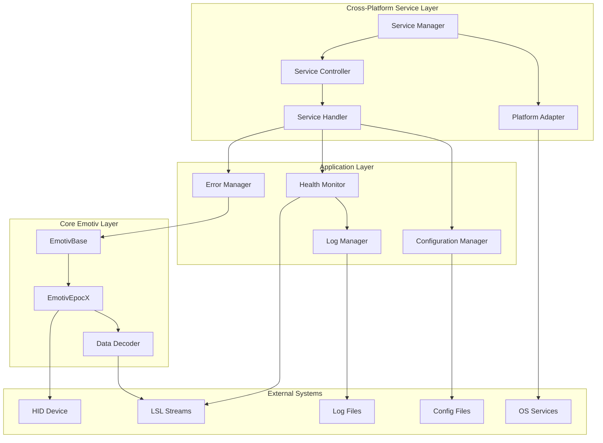

# Design Document: Emotiv LSL Service

## Overview

The Emotiv LSL Service is a robust cross-platform background service wrapper that transforms the existing Emotiv LSL data capture application into a production-ready system service. The service will manage the lifecycle of the core Emotiv data capture functionality, provide health monitoring, error recovery, and configuration management while maintaining the existing LSL streaming capabilities across Windows, Linux, and macOS platforms.

The design leverages the existing `EmotivBase` and `EmotivEpocX` classes while adding cross-platform service infrastructure around them to ensure reliable, continuous operation on all supported operating systems.

**Architectural Principle: Headless Operation**

The service is designed as a pure headless background service with no graphical user interface, visualization, or plotting capabilities. All monitoring, status reporting, and diagnostics are provided through command-line interfaces, log files, and LSL stream metadata. This design ensures minimal resource overhead, eliminates GUI framework dependencies, and enables reliable operation in server and embedded environments.

## Architecture

### High-Level Architecture



### Service Architecture Pattern

The service follows a layered architecture with clear separation of concerns:

1. **Cross-Platform Service Layer**: Handles service lifecycle and system integration across Windows, Linux, and macOS
2. **Application Layer**: Manages configuration, health monitoring, and error handling
3. **Core Emotiv Layer**: Existing data capture and processing logic
4. **External Systems**: Hardware devices, LSL streams, file system, and OS-specific services

## Components and Interfaces

### 1. Service Manager (`EmotivLSLService`)

**Responsibilities:**
- Cross-platform service registration and lifecycle management
- Service start/stop/restart operations
- Integration with platform-specific service managers (Windows SCM, systemd, launchd)

**Key Methods:**
```python
class EmotivLSLService:
    def start(self)
    def stop(self)
    def restart(self)
    def get_status(self)
    def install_service(self)
    def uninstall_service(self)
```

### 2. Platform Adapter (`PlatformAdapter`)

**Responsibilities:**
- Abstract platform-specific service operations
- Handle OS-specific service installation and management
- Provide unified interface for cross-platform functionality

**Platform Implementations:**
```python
class WindowsServiceAdapter:
    def install_service(self)
    def start_service(self)
    def stop_service(self)

class LinuxServiceAdapter:  # systemd
    def install_service(self)
    def start_service(self)
    def stop_service(self)

class MacOSServiceAdapter:  # launchd
    def install_service(self)
    def start_service(self)
    def stop_service(self)
```

### 3. Service Controller (`ServiceController`)

**Responsibilities:**
- Orchestrates all service components
- Manages the main service loop
- Coordinates shutdown procedures

**Key Methods:**
```python
class ServiceController:
    def start_service(self)
    def stop_service(self)
    def run_main_loop(self)
    def handle_shutdown_signal(self)
```

### 4. Configuration Manager (`ConfigurationManager`)

**Responsibilities:**
- Load and validate configuration from files
- Provide configuration hot-reloading
- Manage default settings and validation

**Configuration Structure:**
```yaml
service:
  name: "EmotivLSLService"
  display_name: "Emotiv LSL Data Capture Service"
  description: "Captures EEG data from Emotiv devices and streams via LSL"
  platform_specific:
    windows:
      service_type: "win32"
      start_type: "auto"
    linux:
      service_type: "systemd"
      restart_policy: "always"
      user: "emotiv"
    macos:
      service_type: "launchd"
      run_at_load: true
      keep_alive: true

logging:
  level: "INFO"
  file_path: "logs/emotiv_lsl_service.log"
  max_file_size: "10MB"
  backup_count: 5
  platform_paths:
    windows: "%PROGRAMDATA%/EmotivLSL/logs"
    linux: "/var/log/emotiv-lsl"
    macos: "/usr/local/var/log/emotiv-lsl"

emotiv:
  device_type: "EpocX"
  enable_motion_data: true
  enable_quality_stream: true
  enable_debug_logging: false

recovery:
  max_retry_attempts: 5
  retry_delay_seconds: 2
  exponential_backoff: true
  max_retry_delay: 60

health_monitoring:
  check_interval_seconds: 30
  data_flow_timeout_seconds: 120
  device_connection_timeout_seconds: 10
```

### 5. Health Monitor (`HealthMonitor`)

**Responsibilities:**
- Monitor service health and data flow
- Track performance metrics
- Generate alerts for issues

**Key Metrics:**
- Service uptime
- Data packets processed per second
- LSL stream status
- Device connection status
- Error rates and recovery statistics

### 6. Error Manager (`ErrorManager`)

**Responsibilities:**
- Implement retry logic with exponential backoff
- Handle different error types appropriately
- Maintain error statistics and recovery logs

**Error Handling Strategy:**
- **Device Disconnection**: Automatic reconnection with retry logic
- **USB Communication Errors**: Exponential backoff retry
- **LSL Stream Errors**: Stream reinitialization
- **Configuration Errors**: Graceful degradation with defaults
- **Critical Errors**: Service restart with notification

### 7. Service Wrapper (`EmotivServiceWrapper`)

**Responsibilities:**
- Wrap existing EmotivBase/EmotivEpocX functionality
- Add service-specific error handling and monitoring
- Provide clean shutdown capabilities

## Data Models

### Service State Model

```python
@dataclass
class ServiceState:
    status: ServiceStatus
    uptime_seconds: int
    last_data_timestamp: datetime
    device_connected: bool
    streams_active: Dict[str, bool]
    error_count: int
    recovery_count: int
```

### Health Status Model

```python
@dataclass
class HealthStatus:
    overall_health: HealthLevel
    device_health: HealthLevel
    stream_health: Dict[str, HealthLevel]
    last_check_time: datetime
    issues: List[str]
```

### Configuration Model

```python
@dataclass
class ServiceConfig:
    service_settings: ServiceSettings
    logging_settings: LoggingSettings
    emotiv_settings: EmotivSettings
    recovery_settings: RecoverySettings
    health_settings: HealthSettings
```

## Error Handling

### Error Classification

1. **Recoverable Errors**:
   - Device disconnection
   - Temporary USB communication failures
   - LSL stream interruptions
   - Network connectivity issues

2. **Configuration Errors**:
   - Invalid configuration values
   - Missing configuration files
   - Permission issues

3. **Critical Errors**:
   - Service corruption
   - Unhandled exceptions
   - System resource exhaustion

### Recovery Strategies

1. **Exponential Backoff Retry**:
   - Initial delay: 2 seconds
   - Maximum delay: 60 seconds
   - Maximum attempts: 5

2. **Circuit Breaker Pattern**:
   - Open circuit after 5 consecutive failures
   - Half-open state after 60 seconds
   - Close circuit after successful operation

3. **Graceful Degradation**:
   - Continue with reduced functionality when possible
   - Use default configurations when custom configs fail
   - Maintain core EEG streaming even if auxiliary features fail

## Testing Strategy

### Unit Testing

- **Service Components**: Test each component in isolation
- **Configuration Management**: Validate config loading and validation
- **Error Handling**: Test retry logic and error recovery
- **Health Monitoring**: Verify health check accuracy

### Integration Testing

- **Service Lifecycle**: Test start/stop/restart operations
- **Device Integration**: Test with mock and real Emotiv devices
- **LSL Integration**: Verify stream creation and data flow
- **Configuration Hot-reload**: Test runtime configuration changes

### System Testing

- **Cross-Platform Service Integration**: Test service installation and management on Windows, Linux, and macOS
- **Long-running Stability**: Extended operation tests across all platforms
- **Error Recovery**: Simulate various failure scenarios on each platform
- **Performance**: Monitor resource usage and data throughput across platforms

### Service Installation Testing

- **Cross-Platform Installation Scripts**: Test service registration on all supported platforms
- **Platform-Specific Permissions**: Verify required system permissions for each OS
- **Dependencies**: Test with different Python environments across platforms
- **Uninstallation**: Clean removal verification on all platforms

### Platform-Specific Testing

#### Windows Testing
- Windows Service Control Manager integration
- Windows Event Log functionality
- PowerShell installation scripts
- Windows service recovery mechanisms

#### Linux Testing
- systemd service unit functionality
- journald logging integration
- Shell installation scripts
- udev rules for device access

#### macOS Testing
- launchd plist functionality
- macOS system log integration
- Shell installation scripts
- System extension approval workflows

## Implementation Approach

### Phase 1: Core Service Infrastructure
- Implement Windows service framework
- Create configuration management system
- Set up logging and basic health monitoring

### Phase 2: Emotiv Integration
- Wrap existing Emotiv classes in service context
- Implement error handling and recovery
- Add device connection management

### Phase 3: Advanced Features
- Implement comprehensive health monitoring
- Add configuration hot-reloading
- Create service management utilities

### Phase 4: Production Readiness
- Add comprehensive logging and metrics
- Implement service installation scripts
- Create documentation and deployment guides

## Cross-Platform Service Implementation

### Platform-Specific Service Integration

#### Windows Service Integration
- Uses `pywin32` for Windows Service Control Manager integration
- Implements Windows service lifecycle methods
- Supports Windows service installation and management tools

#### Linux Service Integration (systemd)
- Creates systemd service unit files
- Supports systemd service management commands
- Integrates with system logging via journald

#### macOS Service Integration (launchd)
- Creates launchd plist configuration files
- Supports launchctl service management
- Integrates with macOS system logging

### Service Installation Strategies

#### Windows
```powershell
# Service installation via PowerShell script
python -m emotiv_lsl.service install
sc start EmotivLSLService
```

#### Linux
```bash
# Service installation via systemd
sudo python -m emotiv_lsl.service install
sudo systemctl enable emotiv-lsl-service
sudo systemctl start emotiv-lsl-service
```

#### macOS
```bash
# Service installation via launchd
sudo python -m emotiv_lsl.service install
sudo launchctl load /Library/LaunchDaemons/com.emotiv.lsl.service.plist
```

### Platform-Specific Considerations

#### File System Paths
- **Windows**: Use `%PROGRAMDATA%`, `%APPDATA%` for configuration and logs
- **Linux**: Follow FHS standards (`/etc`, `/var/log`, `/var/run`)
- **macOS**: Use standard macOS paths (`/usr/local/etc`, `/usr/local/var`)

#### User Permissions
- **Windows**: Run as Local System or dedicated service account
- **Linux**: Run as dedicated user with appropriate group permissions
- **macOS**: Run as dedicated user with appropriate privileges

#### Hardware Access
- **Windows**: Requires driver installation and appropriate permissions
- **Linux**: Requires udev rules for USB device access
- **macOS**: May require system extension approval for USB access

## Dependencies

### Core Dependencies
- `pyyaml`: Configuration file parsing
- `watchdog`: Configuration file monitoring
- `psutil`: System resource monitoring
- `click`: Command-line interface

### Platform-Specific Dependencies
- **Windows**: `pywin32` for Windows service integration
- **Linux**: `python-systemd` for systemd integration (optional)
- **macOS**: Standard library sufficient for launchd integration

### Existing Dependencies
- `pylsl`: LabStreamingLayer integration
- `hidapi`: USB HID device communication
- `numpy`: Data processing
- `attrs`: Data classes and validation

### Explicitly Excluded Dependencies

The following dependencies are explicitly excluded from the service to maintain headless operation:

- **Visualization Libraries**: `matplotlib`, `pyplot`, `seaborn`, `plotly`
- **GUI Frameworks**: `PyQt5`, `PyQt6`, `PySide`, `Tkinter`, `wxPython`
- **Interactive Plotting**: `bokeh`, `dash`, `streamlit`
- **Jupyter/Notebook**: `ipykernel`, `jupyter`, `notebook`

Note: While `matplotlib` may be present as a transitive dependency of `mne` (used in examples), the service code must not import or use any visualization functionality.

## Deployment Considerations

### Cross-Platform Service Installation
- **Windows**: PowerShell installation script with Windows SCM registration
- **Linux**: Shell script with systemd service unit creation
- **macOS**: Shell script with launchd plist creation
- Automatic dependency verification across all platforms
- Platform-appropriate log directory creation and permissions

### Configuration Management
- Cross-platform default configuration file creation
- Platform-specific path resolution
- Configuration validation on startup
- Environment-specific configuration support

### Monitoring and Maintenance
- **Windows**: Windows Event Log integration
- **Linux**: systemd journal integration
- **macOS**: macOS system log integration
- Platform-appropriate performance monitoring
- Log rotation and cleanup across all platforms
- Health check endpoints for external monitoring

### Platform-Specific Deployment Notes

#### Windows Deployment
- Requires administrator privileges for service installation
- May need Windows Defender exclusions for optimal performance
- Supports Windows service recovery options

#### Linux Deployment
- Requires sudo privileges for systemd service installation
- Needs udev rules for USB device access
- Supports systemd service dependencies and ordering

#### macOS Deployment
- May require system extension approval for USB access
- Supports launchd service dependencies
- Integrates with macOS security and privacy settings